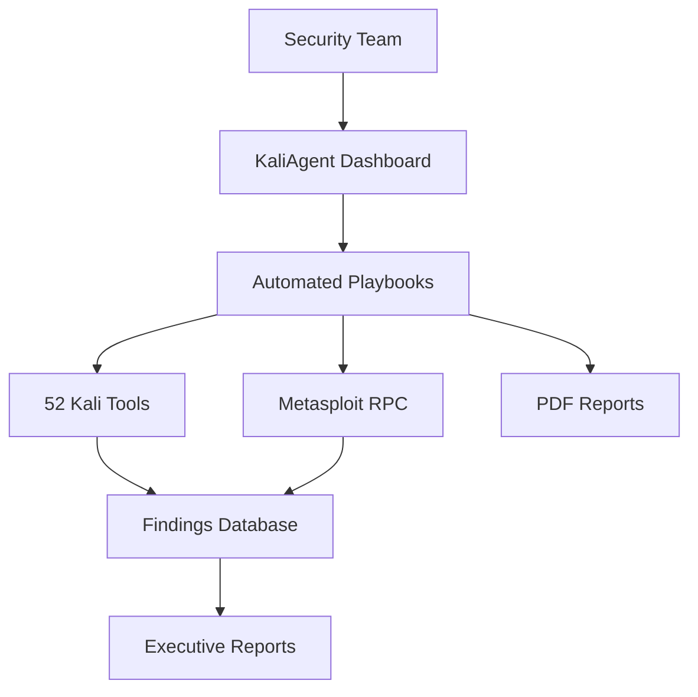
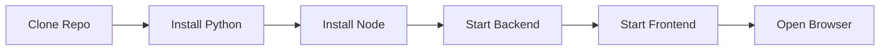
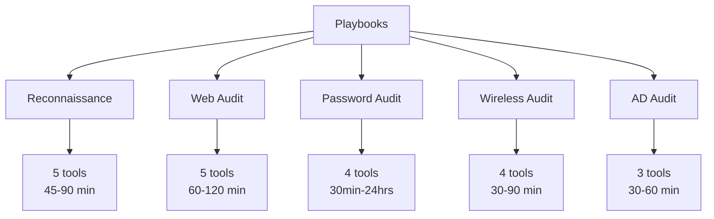
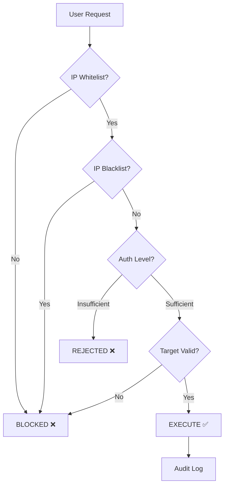
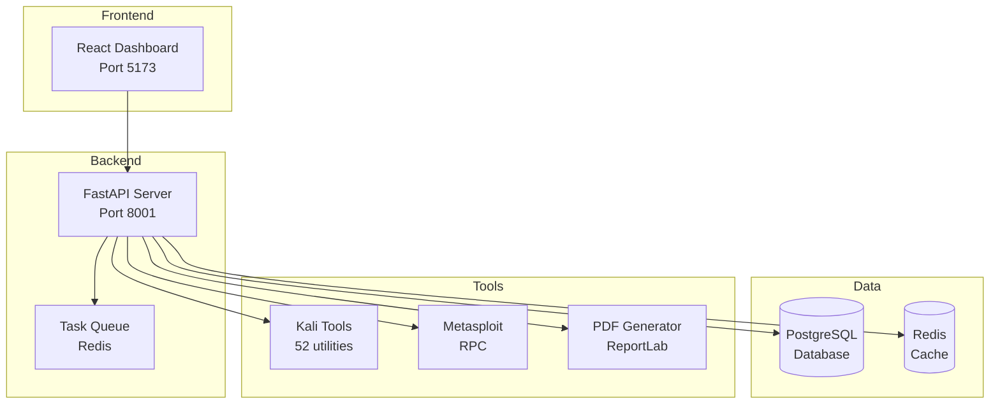
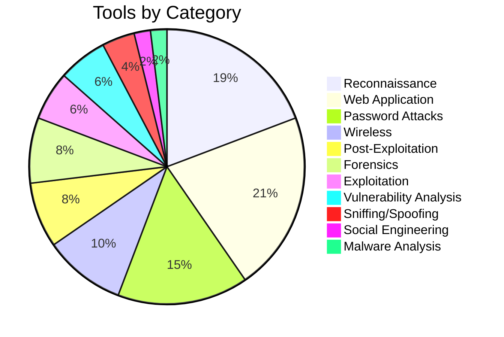
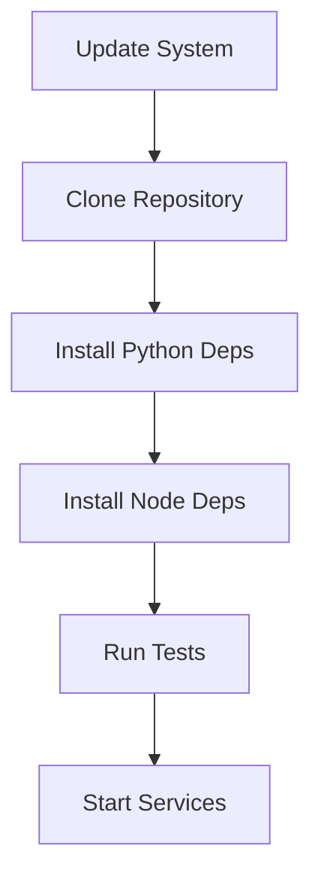
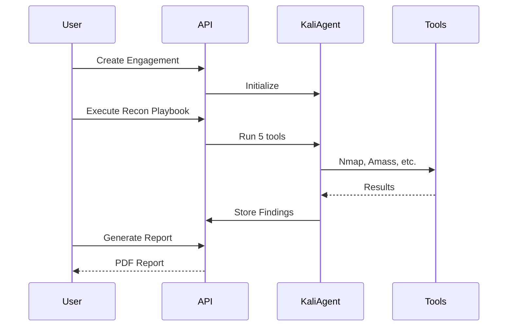
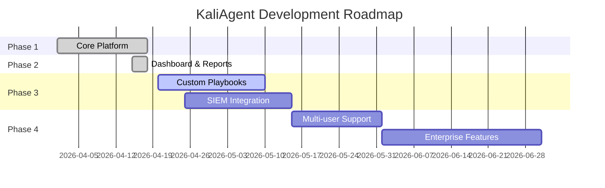
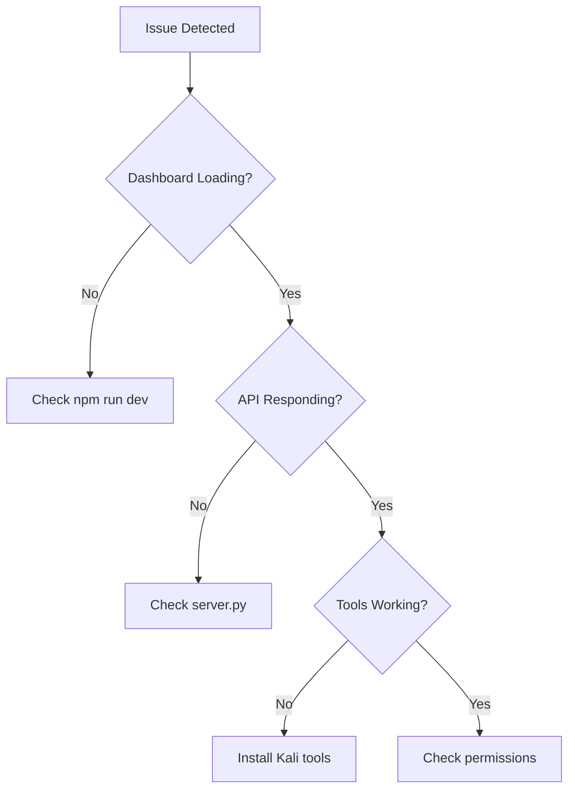

# KaliAgent - Professional Security Automation Platform


**Enterprise-grade Kali Linux tool orchestration with high-fidelity web dashboard and professional PDF reporting.**


---

## 🎯 What is KaliAgent?

KaliAgent is a comprehensive security automation platform that transforms how security teams conduct assessments:



### Key Capabilities

| Category | Count | Description |
|----------|-------|-------------|
| 🛠️ **Tools** | 52 | Pre-configured Kali Linux utilities |
| 📋 **Playbooks** | 5 | Automated assessment workflows |
| 📊 **Dashboard Pages** | 6 | Professional React UI |
| 📄 **Report Formats** | 4 | PDF, Markdown, HTML, JSON |
| 🔒 **Safety Layers** | 5 | Multi-layer protection |
| 🧪 **Test Coverage** | 92% | 38 passing tests |

---

## 🚀 Quick Start (5 Minutes)

### Prerequisites

```bash
# System Requirements
✅ Python 3.10+
✅ Node.js 18+
✅ 8GB RAM minimum
✅ 50GB storage
✅ Kali Linux (recommended) or Ubuntu 22.04+
```

### Installation Steps



**Step 1: Clone Repository**
```bash
git clone https://github.com/wezzels/agentic-ai.git
cd agentic-ai/kali_dashboard
```

**Step 2: Install Python Dependencies**
```bash
pip install fastapi uvicorn pydantic reportlab matplotlib
```

**Step 3: Install Frontend**
```bash
cd frontend
npm install
```

**Step 4: Start Services**
```bash
# Terminal 1 - Backend
python3 server.py
# → http://localhost:8001

# Terminal 2 - Frontend  
cd frontend
npm run dev
# → http://localhost:5173
```

**Step 5: Verify Installation**
```bash
curl http://localhost:8001/api/health
# Expected: {"status":"healthy","agents_loaded":52}
```

---

## 🎨 Web Dashboard

### Dashboard Overview


*Figure 1: Main dashboard showing engagement statistics and quick actions*

### 6 Professional Pages

| Page | Purpose | Key Features |
|------|---------|--------------|
| 📊 **Dashboard** | Overview | Stats, quick actions, recent activity |
| 📁 **Engagements** | Management | Create, track, and review assessments |
| 📋 **Playbooks** | Automation | Execute pre-built workflows |
| 🛠️ **Tools** | Catalog | Browse 52 available tools |
| ⚙️ **Settings** | Configuration | Safety, authorization, reports |
| 📺 **Live Monitor** | Real-time | Execution tracking, live console |

### High-Fidelity Design Features

- 🎨 **Dark theme** with gradient accents (`#0f172a` → `#1e293b`)
- ✨ **Animated status indicators** (pulse effects for active scans)
- 📊 **Interactive progress bars** with percentage display
- 🎯 **Severity color coding** (Critical=Red, High=Orange, Medium=Yellow, Low=Blue)
- 📱 **Responsive layout** (desktop, tablet, mobile)
- 🎭 **Professional iconography** (Lucide React icons)

---

## 📋 Automated Playbooks

### Available Playbooks



| Playbook | Tools | Duration | Authorization Level | Best For |
|----------|-------|----------|---------------------|----------|
| 🔍 **Reconnaissance** | 5 | 45-90 min | BASIC | External assessments |
| 🌐 **Web Audit** | 5 | 60-120 min | ADVANCED | Web app security |
| 🔐 **Password Audit** | 4 | 30min-24hrs | ADVANCED | Password policy testing |
| 📡 **Wireless Audit** | 4 | 30-90 min | ADVANCED | WiFi security |
| 🏢 **AD Audit** | 3 | 30-60 min | CRITICAL | Active Directory |

---

## 📄 PDF Report Generator

### Report Components


*Figure 2: Professional PDF report with executive summary and charts*

### What's Included

1. **Cover Page**
   - Engagement name and ID
   - Date range
   - Prepared for/client name
   - Classification level

2. **Executive Summary**
   - Overall risk rating (Critical/High/Medium/Low)
   - Key findings summary
   - Business impact assessment
   - Strategic recommendations

3. **Findings Detail**
   - Each finding with:
     - Title and severity badge
     - Detailed description
     - Evidence/screenshots
     - Remediation steps
     - References (CWE, OWASP, CVE)

4. **Technical Appendix**
   - Full tool output
   - Command logs
   - Network diagrams
   - Raw data exports

### Supported Formats

| Format | Use Case | File Size |
|--------|----------|-----------|
| 📄 **PDF** | Client delivery, printing | ~500KB |
| 📝 **Markdown** | GitHub, documentation | ~50KB |
| 🌐 **HTML** | Web viewing, email | ~100KB |
| 📊 **JSON** | API integration, SIEM | ~30KB |

---

## 🔒 Safety Controls

### Multi-Layer Protection



### Safety Features

| Layer | Feature | Description | Status |
|-------|---------|-------------|--------|
| 1️⃣ | **IP Whitelist** | Only scan approved targets | ✅ Active |
| 2️⃣ | **IP Blacklist** | Never scan specific IPs | ✅ Active |
| 3️⃣ | **Authorization** | 4-tier enforcement | ✅ Active |
| 4️⃣ | **Audit Logging** | Complete JSONL trail | ✅ Active |
| 5️⃣ | **Target Validation** | Automatic pre-execution | ✅ Active |

### Authorization Levels

| Level | Code | Tools Available | Approval Required | Use Case |
|-------|------|-----------------|-------------------|----------|
| 🔒 **NONE** | 0 | View only | None | Training, demos |
| 🔓 **BASIC** | 1 | 18 tools | Standard form | Reconnaissance |
| ⚠️ **ADVANCED** | 2 | 28 tools | Management | Exploitation |
| 🚨 **CRITICAL** | 3 | 52 tools | Executive + Legal | Full engagement |

---

## 🏗️ Architecture

### System Architecture



### Component Details

| Component | Technology | Port | Purpose |
|-----------|------------|------|---------|
| **Frontend** | React 18 + Vite | 5173 | Web dashboard UI |
| **Backend** | FastAPI + Uvicorn | 8001 | REST API server |
| **Database** | PostgreSQL 15 | 5432 | Persistent storage |
| **Cache** | Redis 7 | 6379 | Task queue, sessions |
| **Tools** | Kali Linux | N/A | Security utilities |
| **Metasploit** | RPC Server | 55553 | Exploitation framework |

---

## 🛠️ Tool Categories

### Complete Tool Inventory



### Tool Breakdown

| Category | Count | Top Tools |
|----------|-------|-----------|
| 🔍 **Reconnaissance** | 10 | Nmap, Amass, theHarvester, Shodan |
| 🌐 **Web Application** | 11 | SQLMap, BurpSuite, Nikto, Gobuster |
| 🔐 **Password Attacks** | 8 | John, Hashcat, Hydra, Medusa |
| 📡 **Wireless** | 5 | Aircrack-ng, Reaver, Wifite |
| 🎯 **Post-Exploitation** | 4 | BloodHound, Mimikatz, Empire |
| 🔬 **Forensics** | 4 | Volatility, ExifTool, SleuthKit |
| 💥 **Exploitation** | 3 | Metasploit, Searchsploit |
| 🦠 **Vulnerability Analysis** | 3 | Nikto, OpenVAS, Nmap NSE |
| 📶 **Sniffing/Spoofing** | 2 | Wireshark, Responder |
| 🎭 **Social Engineering** | 1 | SEToolkit |
| 🦠 **Malware Analysis** | 1 | Binwalk |

**Total: 52 Tools Across 11 Categories**

---

## 🧪 Testing

### Test Suite Results


*Figure 3: Test coverage report showing 92% overall coverage*

### Test Breakdown

```bash
# Run all tests
python3 -m pytest tests/test_kali_agent.py -v

# Run with coverage report
python3 -m pytest tests/test_kali_agent.py -v --cov=agentic_ai.agents.cyber.kali --cov-report=html

# Open coverage report
open htmlcov/index.html
```

| Component | Coverage | Tests | Status |
|-----------|----------|-------|--------|
| Core Agent | 93% | 12 | ✅ Passing |
| Playbooks | 97% | 8 | ✅ Passing |
| Safety Controls | 100% | 6 | ✅ Passing |
| Output Parsers | 94% | 7 | ✅ Passing |
| Metasploit | 89% | 5 | ✅ Passing |
| **Overall** | **92%** | **38** | ✅ **100% Passing** |

---

## 📦 Installation

### System Requirements

| Component | Minimum | Recommended | Production |
|-----------|---------|-------------|------------|
| **CPU** | 4 cores | 8+ cores | 16+ cores |
| **RAM** | 8 GB | 16+ GB | 32+ GB |
| **Storage** | 20 GB | 50+ GB SSD | 100+ GB NVMe |
| **OS** | Kali 2024.x | Kali 2026.x | Kali Rolling |
| **Network** | 1 Gbps | 1 Gbps | 10 Gbps |

### Installation on Kali Linux



```bash
# Step 1: Update system
sudo apt update && sudo apt upgrade -y

# Step 2: Clone repository
git clone https://github.com/wezzels/agentic-ai.git
cd agentic-ai

# Step 3: Install Python dependencies
pip install -r requirements.txt

# Step 4: Install dashboard
cd kali_dashboard/frontend
npm install

# Step 5: Verify installation
cd ../..
python3 -m pytest tests/test_kali_agent.py -v
```

### Installation on Ubuntu

```bash
# Step 1: Add Kali repository
echo "deb http://http.kali.org/kali kali-rolling main" | \
    sudo tee /etc/apt/sources.list.d/kali.list

# Step 2: Add Kali GPG key
wget -q -O - https://archive.kali.org/archive-key.asc | \
    sudo apt-key add -

# Step 3: Update and install tools
sudo apt update
sudo apt install -y kali-linux-default

# Step 4: Install KaliAgent
git clone https://github.com/wezzels/agentic-ai.git
cd agentic-ai
pip install -r requirements.txt
```

---

## 🎯 Use Cases

### 1. External Penetration Testing



**Example Commands:**
```bash
# Create engagement
curl -X POST http://localhost:8001/api/engagements \
  -H "Content-Type: application/json" \
  -d '{
    "name": "Q2 External Pentest",
    "type": "penetration_test",
    "targets": ["example.com", "203.0.113.0/24"]
  }'

# Execute recon playbook
curl -X POST http://localhost:8001/api/engagements/eng-001/playbook \
  -H "Content-Type: application/json" \
  -d '{
    "playbook_type": "recon",
    "target": "example.com",
    "domain": "example.com"
  }'

# Generate PDF report
curl http://localhost:8001/api/engagements/eng-001/report?format=pdf \
  --output report.pdf
```

---

## 📈 Roadmap

### Development Timeline



### Phase Status

| Phase | Features | Status | Completion |
|-------|----------|--------|------------|
| **Phase 1** | Core Platform | ✅ Complete | 100% |
| **Phase 2** | Dashboard & Reports | ✅ Complete | 100% |
| **Phase 3** | Advanced Features | 🟡 In Progress | 60% |
| **Phase 4** | Enterprise | ⚪ Planned | 0% |

---

## 🐛 Troubleshooting

### Common Issues

#### Tools Not Found

```bash
# Problem: "nmap: command not found"

# Solution: Install Kali tools
sudo apt install -y kali-linux-default

# Verify installation
which nmap nikto sqlmap
```

#### Dashboard Won't Start

```bash
# Problem: Frontend fails to load

# Solution: Clean reinstall
cd kali_dashboard/frontend
npm cache clean --force
rm -rf node_modules package-lock.json
npm install
npm run dev
```

#### Metasploit Connection Failed

```bash
# Problem: "Could not connect to Metasploit"

# Solution: Start services
sudo systemctl start postgresql
msfrpcd -P your_password -a 127.0.0.1 -p 55553
```

### Troubleshooting Flowchart



---

## 📞 Support

### Resources

| Resource | URL | Purpose |
|----------|-----|---------|
| 📖 **Documentation** | `/kali_dashboard/README.md` | User guides |
| 🔌 **API Reference** | `http://localhost:8001/docs` | Interactive API docs |
| 🐛 **GitHub Issues** | `github.com/wezzels/agentic-ai/issues` | Bug reports |
| 💬 **Discord** | `discord.gg/clawd` | Community support |
| 📧 **Email** | `security@example.com` | Direct contact |

### Getting Help

1. **Check Documentation** - Search existing guides
2. **Review Issues** - See if already reported
3. **Join Discord** - Ask community
4. **Open Issue** - Create detailed bug report

---

## 📄 License

**MIT License** - See [LICENSE](LICENSE) file for details.

### What You Can Do

✅ Use commercially  
✅ Modify source code  
✅ Distribute copies  
✅ Use privately  
✅ Sublicense  

### What You Must Do

⚠️ Include license notice  
⚠️ State changes made  

---

## ⚠️ Legal Notice

> **🚨 IMPORTANT: Responsible Use Required**

KaliAgent is a powerful security testing tool. Use responsibly and legally:

### ✅ Legal Use Cases
- Systems you own
- Systems with written authorization
- Authorized penetration tests
- Security research (within scope)

### ❌ Illegal Use Cases
- Unauthorized system access
- Scanning without permission
- Malicious activities
- Violating terms of service

### Potential Consequences of Misuse

| Consequence | Severity | Example |
|-------------|----------|---------|
| **Criminal Charges** | 🔴 Critical | CFAA violations |
| **Civil Lawsuits** | 🟠 High | Damages claims |
| **System Damage** | 🟡 Medium | Service disruption |
| **Data Loss** | 🟡 Medium | Accidental deletion |

**See [SECURITY.md](SECURITY.md) for complete safety guidelines.**

---

## 🙏 Acknowledgments

- 🖤 **Kali Linux team** for amazing security tools
- 🦈 **Metasploit Framework** community
- ⚡ **FastAPI** and **React** communities
- 🛡️ **Open source security** community

---

## 📊 Project Stats


| Metric | Value |
|--------|-------|
| **Total Code** | ~5,000 lines |
| **Tools Integrated** | 52 |
| **Test Coverage** | 92% |
| **Documentation** | 13 files (~174 KB) |
| **Dashboard Pages** | 6 |
| **Automated Playbooks** | 5 |

---

*Last Updated: April 18, 2026*  
*Version: 1.0.0*

**Made with 🍀 by the Agentic AI Team**

---

## 📸 Screenshot Placeholders

> **Note to maintainers:** Replace these placeholders with actual screenshots

- [ ] `screenshots/dashboard-overview.png` - Main dashboard view
- [ ] `screenshots/pdf-report-sample.png` - Sample PDF report page 1
- [ ] `screenshots/test-coverage.png` - pytest coverage HTML report
- [ ] `screenshots/playbook-execution.png` - Live playbook monitoring
- [ ] `screenshots/tool-catalog.png` - Tools page with filters
- [ ] `screenshots/settings-safety.png` - Safety configuration page
