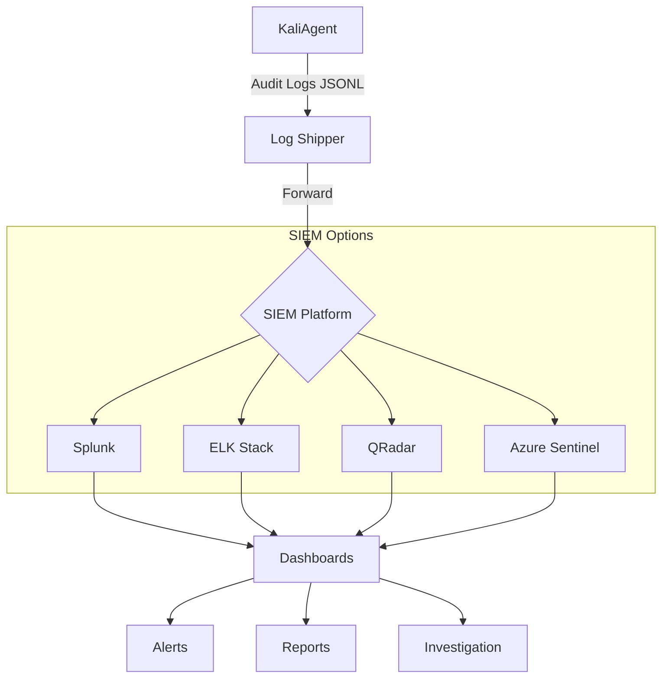
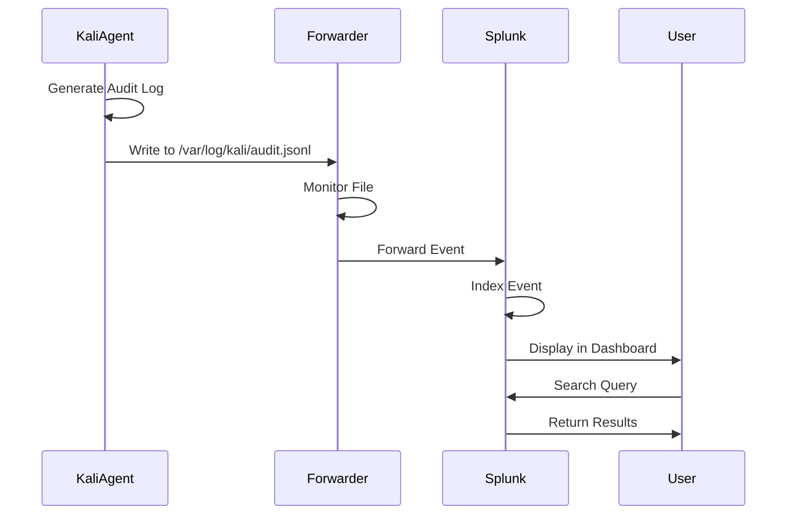
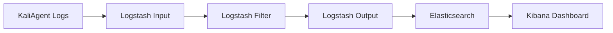
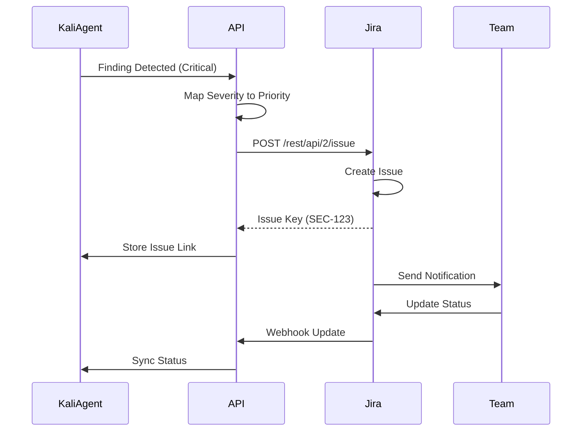
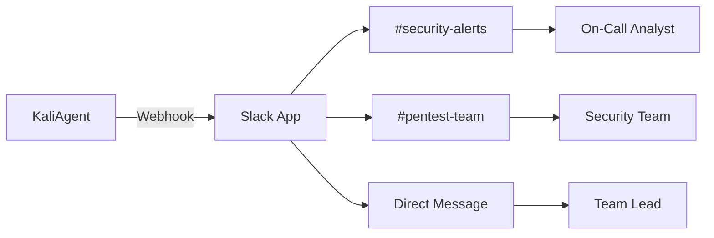
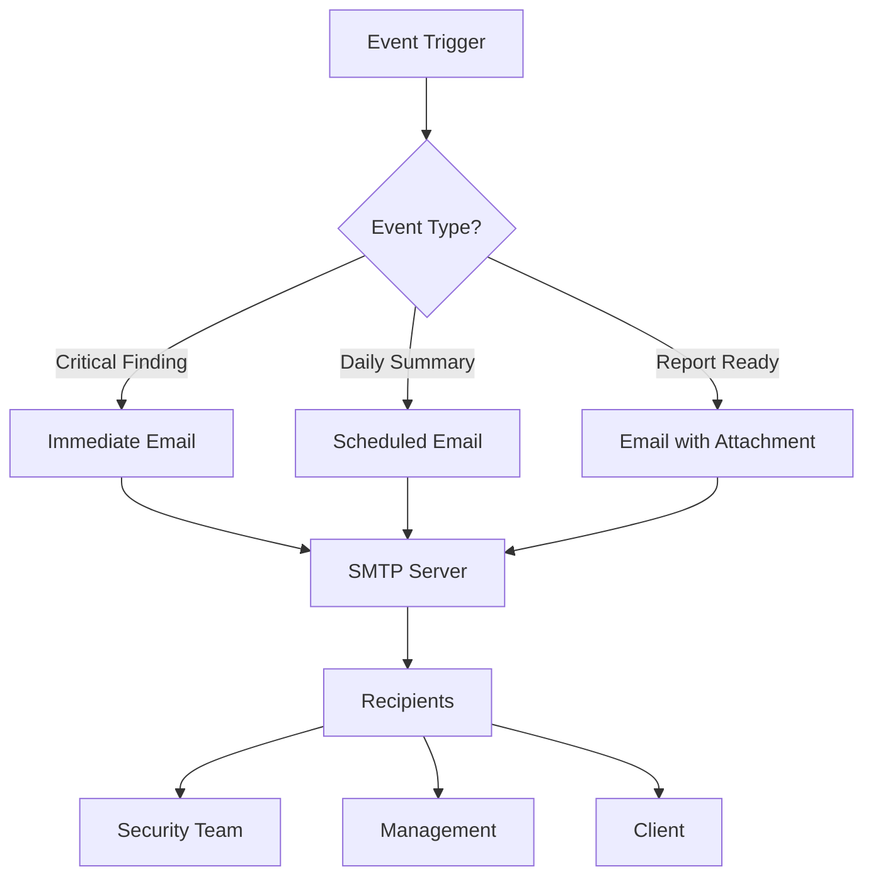
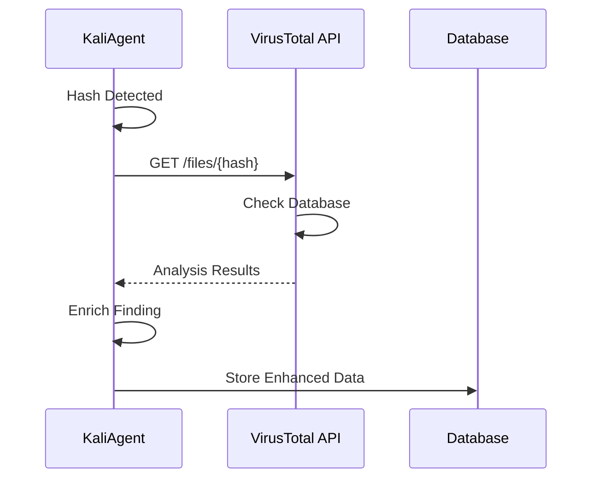
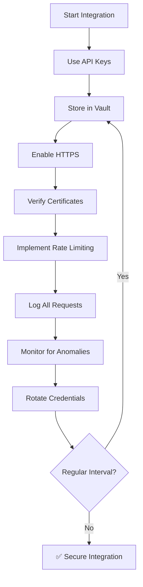

# KaliAgent Integration Guides

Integrate KaliAgent with your existing security tools and workflows with visual diagrams.

---

## Table of Contents

1. [SIEM Integration](#siem-integration)
2. [Ticketing Systems](#ticketing-systems)
3. [Slack/Teams Notifications](#slackteams-notifications)
4. [Email Integration](#email-integration)
5. [Vulnerability Scanners](#vulnerability-scanners)
6. [Threat Intelligence](#threat-intelligence)
7. [SOAR Platforms](#soar-platforms)
8. [Custom Webhooks](#custom-webhooks)
9. [API Client Examples](#api-client-examples)
10. [Best Practices](#best-practices)

---

## SIEM Integration

### Integration Architecture



### Splunk Integration

#### Data Flow



#### Configuration Files

**inputs.conf:**
```ini
[monitor:///var/log/kali/audit.jsonl]
disabled = false
index = security
sourcetype = kali:audit
host = kali-agent-server
```

**props.conf:**
```ini
[kali:audit]
TIME_FORMAT = %Y-%m-%dT%H:%M:%S.%3NZ
TIME_PREFIX = "timestamp":\s*"
MAX_TIMESTAMP_LOOKAHEAD = 32
SHOULD_LINEMERGE = false
LINE_BREAKER = ([\r\n]+)
KV_MODE = json
```

#### Splunk Dashboard XML

**dashboard.xml:**
```xml
<dashboard theme="dark">
  <label>KaliAgent Security Monitoring</label>
  <row>
    <panel>
      <title>Tool Executions (24h)</title>
      <chart>
        <search>
          <query>index=security sourcetype=kali:audit 
          | timechart span=1h count by tool_name</query>
        </search>
      </chart>
    </panel>
  </row>
  <row>
    <panel>
      <title>Findings by Severity</title>
      <chart>
        <search>
          <query>index=security sourcetype=kali:audit 
          | stats count by findings.severity</query>
        </search>
      </chart>
    </panel>
  </row>
</dashboard>
```

---

### ELK Stack Integration

#### Logstash Pipeline



**logstash.conf:**
```conf
input {
  file {
    path => "/var/log/kali/audit.jsonl"
    codec => json
    type => "kali-audit"
    start_position => "beginning"
  }
}

filter {
  if [type] == "kali-audit" {
    # Parse timestamp
    date {
      match => [ "timestamp", "ISO8601" ]
      target => "@timestamp"
    }
    
    # Add tags
    mutate {
      add_tag => ["kali", "security", "pentesting"]
    }
    
    # Categorize by severity
    if [findings] {
      foreach => "findings" {
        if "[findings][severity]" == "critical" {
          mutate {
            add_tag => ["critical_finding"]
          }
        }
      }
    }
  }
}

output {
  elasticsearch {
    hosts => ["elasticsearch:9200"]
    index => "kali-audit-%{+YYYY.MM.dd}"
  }
  
  # Alert on critical findings
  if "critical_finding" in [tags] {
    email {
      to => "security-team@example.com"
      subject => "CRITICAL Finding: %{tool_name}"
    }
  }
}
```

#### Kibana Dashboard Import

**dashboard.ndjson:**
```json
[
  {
    "attributes": {
      "description": "KaliAgent Audit Dashboard",
      "kibanaSavedObjectMeta": {
        "searchSourceJSON": "{\"query\":{\"query\":\"\",\"language\":\"kuery\"}}"
      },
      "panelsJSON": "[{\"gridData\":{\"x\":0,\"y\":0,\"w\":24,\"h\":15},\"panelIndex\":\"1\",\"type\":\"visualization\",\"id\":\"tool-executions\"}]",
      "timeRestore": false,
      "title": "KaliAgent Security Monitoring",
      "version": "8.11.0"
    },
    "type": "dashboard"
  }
]
```

---

## Ticketing Systems

### Jira Integration Flow



### Jira Integration Code

**kali_jira.py:**
```python
from jira import JIRA
from typing import List, Dict

class KaliJiraIntegration:
    def __init__(self, jira_url: str, username: str, api_token: str):
        self.jira = JIRA(server=jira_url, basic_auth=(username, api_token))
        
        # Severity to Jira priority mapping
        self.priority_map = {
            'critical': 'Highest',
            'high': 'High',
            'medium': 'Medium',
            'low': 'Low',
            'informational': 'Lowest'
        }
    
    def create_ticket_from_finding(self, finding: Dict, engagement_id: str) -> str:
        """Create Jira ticket for a finding"""
        
        issue_dict = {
            'project': {'key': 'SEC'},
            'summary': f"[KaliAgent] {finding['title']}",
            'description': self._format_description(finding),
            'issuetype': {'name': 'Security Issue'},
            'priority': {'name': self.priority_map.get(finding['severity'], 'Medium')},
            'labels': ['kali-agent', 'security', 'pentesting', engagement_id],
            'customfield_10010': engagement_id,  # Custom field for engagement ID
        }
        
        new_issue = self.jira.create_issue(fields=issue_dict)
        
        # Attach report if available
        if 'report_url' in finding:
            self.jira.add_attachment(issue=new_issue, attachment=finding['report_url'])
        
        return new_issue.key
    
    def bulk_create_tickets(self, findings: List[Dict], engagement_id: str) -> List[str]:
        """Create tickets for multiple findings"""
        tickets = []
        for finding in findings:
            if finding['severity'] in ['critical', 'high']:
                ticket_key = self.create_ticket_from_finding(finding, engagement_id)
                tickets.append(ticket_key)
        return tickets
```

---

## Slack/Teams Notifications

### Slack Integration Architecture



### Slack Message Templates

**Critical Finding Alert:**
```python
def send_critical_finding_alert(finding, engagement_id):
    """Send Slack alert for critical finding"""
    
    payload = {
        "channel": "#security-alerts",
        "username": "KaliAgent Bot",
        "icon_emoji": ":rotating_light:",
        "attachments": [
            {
                "color": "danger",
                "title": "🚨 CRITICAL Security Finding",
                "fields": [
                    {
                        "title": "Finding",
                        "value": finding['title'],
                        "short": False
                    },
                    {
                        "title": "Severity",
                        "value": "CRITICAL",
                        "short": True
                    },
                    {
                        "title": "Target",
                        "value": finding.get('target', 'N/A'),
                        "short": True
                    },
                    {
                        "title": "Tool",
                        "value": finding.get('tool', 'N/A'),
                        "short": True
                    },
                    {
                        "title": "Engagement",
                        "value": engagement_id,
                        "short": True
                    }
                ],
                "footer": "KaliAgent Security Automation",
                "ts": int(time.time())
            }
        ]
    }
    
    requests.post(SLACK_WEBHOOK_URL, json=payload)
```

---

## Email Integration

### Email Workflow



### Email Configuration

**smtp_config.py:**
```python
import smtplib
from email.mime.multipart import MIMEMultipart
from email.mime.text import MIMEText
from email.mime.base import MIMEBase
from email import encoders

class KaliEmailIntegration:
    def __init__(self, smtp_host, smtp_port, username, password, from_email):
        self.smtp_host = smtp_host
        self.smtp_port = smtp_port
        self.username = username
        self.password = password
        self.from_email = from_email
    
    def send_report(self, to_emails, subject, body, attachment_path=None):
        """Send email with optional attachment"""
        
        msg = MIMEMultipart()
        msg['From'] = self.from_email
        msg['To'] = ', '.join(to_emails)
        msg['Subject'] = subject
        
        msg.attach(MIMEText(body, 'html'))
        
        if attachment_path:
            with open(attachment_path, 'rb') as attachment:
                part = MIMEBase('application', 'octet-stream')
                part.set_payload(attachment.read())
                encoders.encode_base64(part)
                part.add_header(
                    'Content-Disposition',
                    f'attachment; filename={attachment_path.split("/")[-1]}'
                )
                msg.attach(part)
        
        server = smtplib.SMTP(self.smtp_host, self.smtp_port)
        server.starttls()
        server.login(self.username, self.password)
        server.send_message(msg)
        server.quit()
```

---

## Threat Intelligence

### VirusTotal Integration Flow



### VirusTotal Integration Code

**virustotal_integration.py:**
```python
import requests

class KaliVirusTotalIntegration:
    def __init__(self, api_key: str):
        self.api_key = api_key
        self.base_url = 'https://www.virustotal.com/api/v3'
        self.headers = {'x-apikey': api_key}
    
    def check_hash(self, file_hash: str) -> dict:
        """Check file hash against VirusTotal"""
        
        response = requests.get(
            f"{self.base_url}/files/{file_hash}",
            headers=self.headers
        )
        
        if response.status_code == 200:
            data = response.json()['data']
            return {
                'detections': data['last_analysis_stats']['malicious'],
                'total': sum(data['last_analysis_stats'].values()),
                'permalink': data['links']['self'],
                'first_seen': data['first_submission_date'],
                'tags': data.get('tags', [])
            }
        
        return None
    
    def enrich_finding(self, finding: dict) -> dict:
        """Enrich finding with threat intelligence"""
        
        if 'hash' in finding:
            vt_data = self.check_hash(finding['hash'])
            if vt_data:
                finding['threat_intel'] = {
                    'source': 'VirusTotal',
                    'detections': f"{vt_data['detections']}/{vt_data['total']}",
                    'permalink': vt_data['permalink']
                }
        
        return finding
```

---

## Best Practices

### Integration Security



### Error Handling

| Error Type | Retry Strategy | Max Retries | Fallback |
|------------|----------------|-------------|----------|
| **Network Timeout** | Exponential backoff | 3 | Queue for later |
| **Rate Limit (429)** | Wait Retry-After header | 5 | Throttle requests |
| **Auth Failure (401)** | No retry | 0 | Alert admin |
| **Server Error (500)** | Fixed delay (30s) | 3 | Use cached data |
| **Invalid Data (400)** | No retry | 0 | Log & skip |

### Performance Optimization

**Batching Strategy:**

```python
# Bad: One request per finding
for finding in findings:
    send_to_siem(finding)  # 100 requests

# Good: Batch multiple findings
batch_size = 50
for i in range(0, len(findings), batch_size):
    batch = findings[i:i+batch_size]
    send_to_siem(batch)  # 2 requests
```

**Caching Strategy:**

```python
from functools import lru_cache

@lru_cache(maxsize=1000)
def check_virustotal(hash: str) -> dict:
    """Cache VirusTotal results for 24 hours"""
    return vt_api.check_hash(hash)
```

---

*Last Updated: April 18, 2026*  
*Version: 2.0.0 (Improved with Mermaid diagrams)*

**Integration ready! 🔗**
