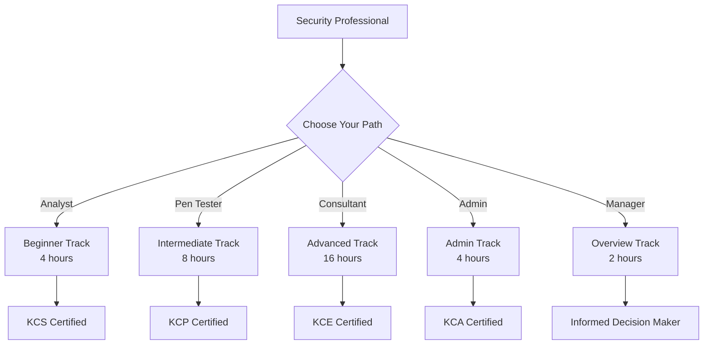
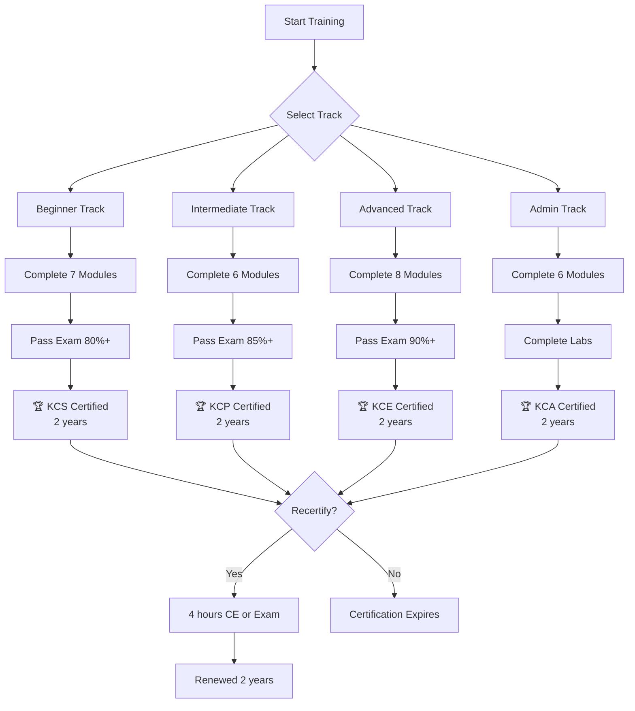
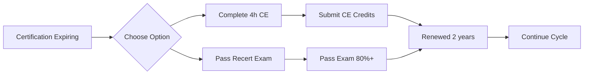
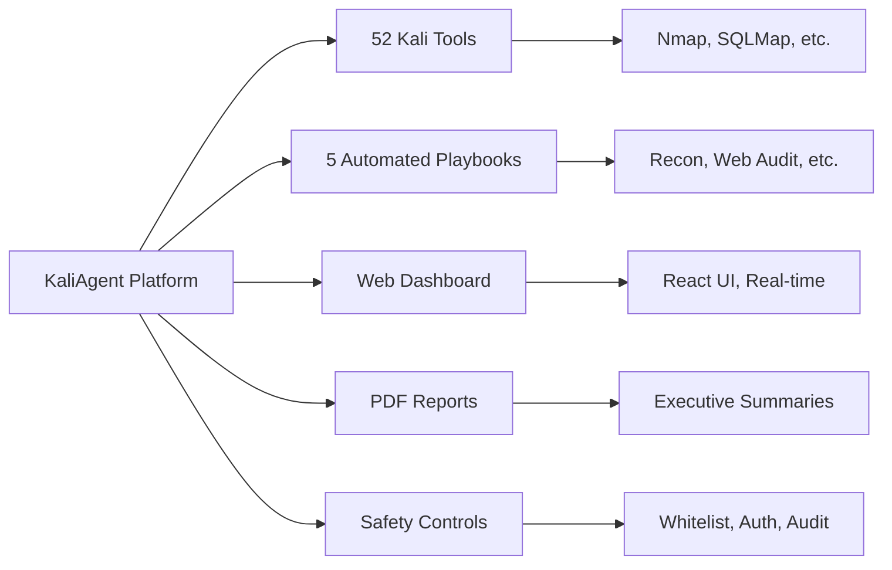
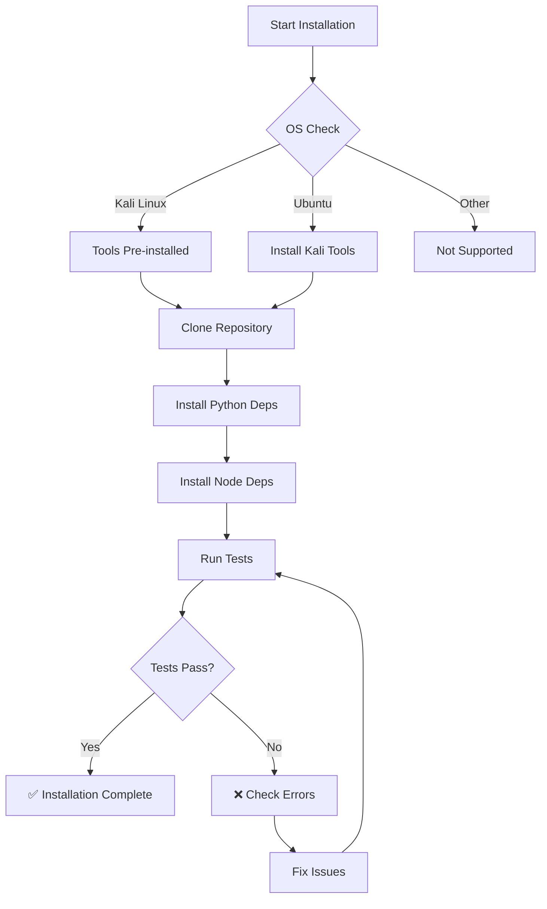
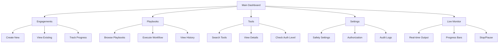
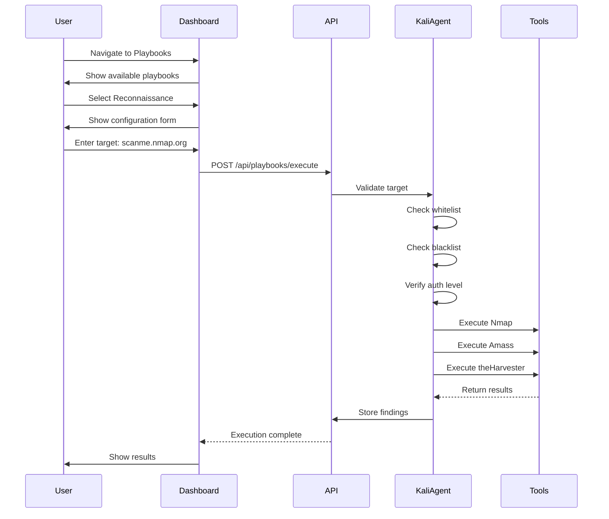
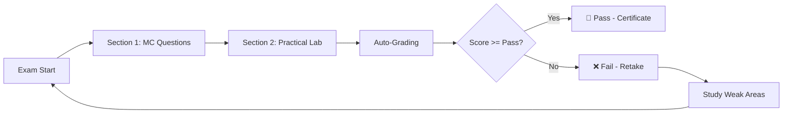
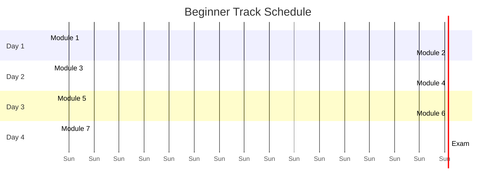
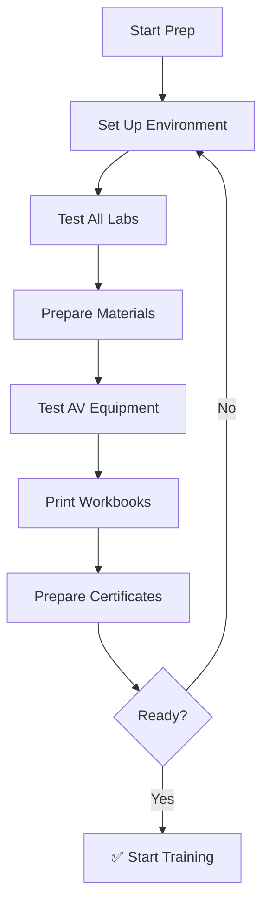

# KaliAgent Training Materials

Complete training curriculum with interactive diagrams and certification paths.

---

## Table of Contents

1. [Training Overview](#training-overview)
2. [Certification Path](#certification-path)
3. [Beginner Track](#beginner-track)
4. [Intermediate Track](#intermediate-track)
5. [Advanced Track](#advanced-track)
6. [Admin Track](#admin-track)
7. [Hands-On Labs](#hands-on-labs)
8. [Assessment Exams](#assessment-exams)
9. [Training Schedule](#training-schedule)
10. [Instructor Guide](#instructor-guide)
11. [Certification Program](#certification-program)

---

## Training Overview

### Learning Objectives

By the end of this training, participants will be able to:

✅ Install and configure KaliAgent  
✅ Execute security assessment playbooks  
✅ Interpret and report findings  
✅ Configure safety controls  
✅ Integrate with existing tools  
✅ Troubleshoot common issues  
✅ Administer KaliAgent deployments  

### Target Audience



### Role-Based Training Paths

| Role | Track | Duration | Certification | Prerequisites |
|------|-------|----------|---------------|---------------|
| 🔰 **Security Analyst** | Beginner | 4 hours | KCS | Basic Linux, networking |
| 🔐 **Penetration Tester** | Intermediate | 8 hours | KCP | 1+ year experience |
| 🎯 **Security Consultant** | Advanced | 16 hours | KCE | 3+ years pentesting |
| ⚙️ **System Administrator** | Admin | 4 hours | KCA | Linux admin, Docker |
| 👔 **Security Manager** | Overview | 2 hours | N/A | Management role |

---

## Certification Path

### Certification Hierarchy



### Certification Levels

| Level | Code | Name | Requirements | Validity |
|-------|------|------|--------------|----------|
| 🥉 **Level 1** | KCS | KaliAgent Certified Specialist | Beginner track + 80% exam | 2 years |
| 🥈 **Level 2** | KCP | KaliAgent Certified Professional | Intermediate + 85% exam + KCS | 2 years |
| 🥇 **Level 3** | KCE | KaliAgent Certified Expert | Advanced + 90% exam + KCP | 2 years |
| ⚙️ **Specialist** | KCA | KaliAgent Certified Admin | Admin track + labs | 2 years |

### Recertification Requirements



**Continuing Education (CE) Options:**

| Activity | CE Hours | Max per Cycle |
|----------|----------|---------------|
| **Advanced Webinars** | 2 hours | 4 hours |
| **Case Studies** | 1 hour | 2 hours |
| **Community Contribution** | 1 hour | 2 hours |
| **Recertification Exam** | 4 hours | Unlimited |

---

## Beginner Track

### Module 1: Introduction to KaliAgent (30 min)

#### Learning Objectives

After this module, you will be able to:
- Explain what KaliAgent does
- Identify key features
- Recognize appropriate use cases
- Understand safety considerations

#### What is KaliAgent?

**Definition:** KaliAgent is a professional security automation platform that orchestrates 52 Kali Linux tools with safety controls and professional reporting.

**Key Capabilities:**



#### Knowledge Check

**Question 1:** How many Kali Linux tools does KaliAgent integrate?

- A) 25
- B) 52 ✅
- C) 100
- D) 10

**Question 2:** Which is NOT a playbook type?

- A) Reconnaissance
- B) Web Audit
- C) Social Media Audit ✅
- D) Password Cracking

---

### Module 2: Installation & Setup (45 min)

#### Learning Objectives

After this module, you will be able to:
- Install KaliAgent dependencies
- Configure the platform
- Verify installation
- Troubleshoot common issues

#### Installation Flowchart



#### Hands-On Lab

**Step 1: Clone Repository**
```bash
git clone https://github.com/wezzels/agentic-ai.git
cd agentic-ai/kali_dashboard
```

**Step 2: Install Python Dependencies**
```bash
pip3 install -r requirements.txt
```

**Step 3: Install Frontend**
```bash
cd frontend
npm install
```

**Step 4: Start Services**
```bash
# Terminal 1 - Backend
cd ..
python3 server.py

# Terminal 2 - Frontend
cd frontend
npm run dev
```

**Step 5: Verify Installation**
```bash
curl http://localhost:8001/api/health
# Expected: {"status": "healthy"}
```

---

### Module 3: Dashboard Navigation (30 min)

#### Dashboard Pages



#### Navigation Exercise

Navigate to each page and document:
1. Page URL
2. 3 key elements
3. 1 action performed

---

### Module 4: Running Your First Playbook (60 min)

#### Playbook Execution Flow



---

## Assessment Exams

### Exam Structure



### Exam Details

| Track | Questions | Practical | Passing Score | Time Limit |
|-------|-----------|-----------|---------------|------------|
| **Beginner** | 20 MC | 1 lab | 80% | 60 min |
| **Intermediate** | 15 MC | 2 labs | 85% | 90 min |
| **Advanced** | 10 MC | 3 labs | 90% | 120 min |
| **Admin** | 15 MC | 2 labs | 85% | 90 min |

---

## Training Schedule

### Week 1: Beginner Track



---

## Instructor Guide

### Preparation Checklist



---

## Certification Program

### Benefits by Level

| Benefit | KCS | KCP | KCE | KCA |
|---------|-----|-----|-----|-----|
| **Digital Badge** | ✅ | ✅ | ✅ | ✅ |
| **Certificate PDF** | ✅ | ✅ | ✅ | ✅ |
| **Community Access** | ✅ | ✅ | ✅ | ✅ |
| **Priority Support** | ❌ | ✅ | ✅ | ✅ |
| **Expert Directory** | ❌ | ❌ | ✅ | ❌ |
| **Beta Features** | ❌ | ❌ | ✅ | ✅ |
| **Instructor Status** | ❌ | ❌ | ✅ | ❌ |

---

*Last Updated: April 18, 2026*  
*Version: 2.0.0 (Improved with Mermaid diagrams)*
