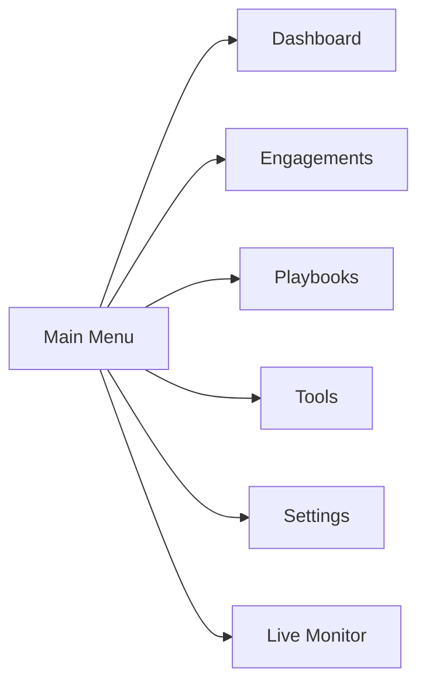
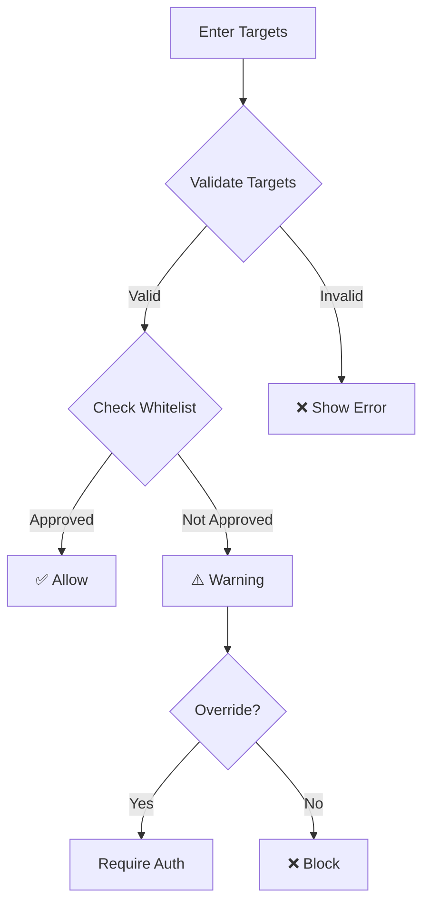
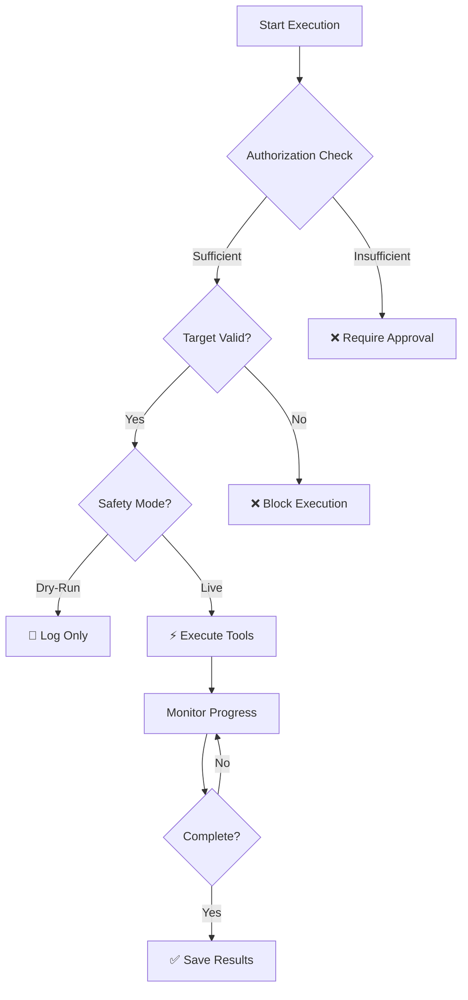
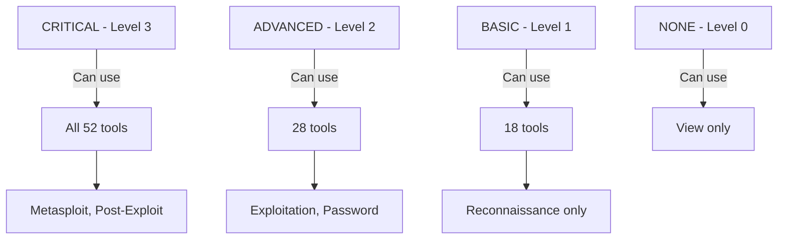
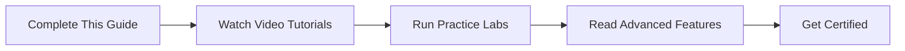

# KaliAgent User Guide

Complete step-by-step guide for using KaliAgent with screenshots and examples.

---

## Table of Contents

1. [Getting Started](#getting-started)
2. [Dashboard Overview](#dashboard-overview)
3. [Creating Your First Engagement](#creating-your-first-engagement)
4. [Executing Playbooks](#executing-playbooks)
5. [Viewing Results](#viewing-results)
6. [Generating Reports](#generating-reports)
7. [Configuring Safety](#configuring-safety)
8. [Advanced Features](#advanced-features)

---

## Getting Started

### Prerequisites

✅ Python 3.10+  
✅ Node.js 18+  
✅ 8GB RAM  
✅ 50GB storage  
✅ Kali Linux (recommended) or Ubuntu 22.04+

### Installation

```bash
# Clone repository
git clone https://github.com/wezzels/agentic-ai.git
cd agentic-ai/kali_dashboard

# Install Python dependencies
pip install fastapi uvicorn pydantic reportlab matplotlib

# Install frontend
cd frontend
npm install

# Start services (Terminal 1 - Backend)
cd ..
python3 server.py

# Start services (Terminal 2 - Frontend)
cd frontend
npm run dev
```

### Access Dashboard

Open browser to: **http://localhost:5173**

---

## Dashboard Overview

### Main Dashboard Page


*Figure 1: Main dashboard showing engagement statistics and quick actions*

### Key Sections

| Section | Description | Quick Access |
|---------|-------------|--------------|
| **① Quick Actions** | Create engagement, execute playbook, view reports | Top-left |
| **② Engagement Stats** | Total, active, completed engagements | Top-right |
| **③ Safety Status** | Whitelist, blacklist, audit log status | Middle-right |
| **④ Recent Engagements** | List of recent security assessments | Bottom |

### Navigation Menu



---

## Creating Your First Engagement

### Step 1: Navigate to Engagements

Click **Engagements** in the left sidebar.


*Figure 2: Engagements list view*

---

### Step 2: Create New Engagement

Click **+ New Engagement** button.


*Figure 3: Create new engagement form*

### Step 3: Fill Engagement Details

**Required Fields:**

| Field | Value | Example |
|-------|-------|---------|
| **Name** | Engagement name | `Q2 External Pentest` |
| **Type** | Assessment type | `Penetration Test` |
| **Targets** | IP addresses or domains | `example.com, 203.0.113.0/24` |
| **Start Date** | When to begin | `2026-04-18` |
| **End Date** | When to complete | `2026-04-25` |

**Optional Fields:**

| Field | Description |
|-------|-------------|
| **Description** | Detailed scope and objectives |
| **Client** | Client name (for consultants) |
| **Tags** | Labels for organization |
| **Team Members** | Assigned analysts |

### Step 4: Configure Safety



**Safety Checks:**
1. Target format validation (IP/domain/CIDR)
2. Whitelist verification
3. Blacklist check
4. Authorization level requirement

### Step 5: Save Engagement

Click **Create Engagement** button.

✅ **Success:** Engagement created and listed  
⚠️ **Warning:** Target not in whitelist (requires approval)  
❌ **Error:** Invalid target format or blacklisted

---

## Executing Playbooks

### Available Playbooks


*Figure 4: Available automated playbooks*

### Playbook Types

| Playbook | Tools | Duration | Authorization | Use Case |
|----------|-------|----------|---------------|----------|
| 🔍 **Reconnaissance** | 5 | 45-90 min | BASIC | External assessments |
| 🌐 **Web Audit** | 5 | 60-120 min | ADVANCED | Web application security |
| 🔐 **Password Audit** | 4 | 30min-24hrs | ADVANCED | Password policy testing |
| 📡 **Wireless Audit** | 4 | 30-90 min | ADVANCED | WiFi security assessment |
| 🏢 **AD Audit** | 3 | 30-60 min | CRITICAL | Active Directory assessment |

### Step-by-Step Execution

#### Step 1: Select Playbook

Navigate to **Playbooks** and choose your playbook.


*Figure 5: Playbook execution interface*

#### Step 2: Configure Parameters

**Reconnaissance Playbook Example:**

```yaml
Target: scanme.nmap.org
Domain: scanme.nmap.org
Ports: 1-1000
Rate Limit: 100 packets/sec
```

**Web Audit Playbook Example:**

```yaml
URL: https://testphp.vulnweb.com
Target: testphp.vulnweb.com
Depth: 3
Wordlist: /usr/share/wordlists/dirb/common.txt
```

#### Step 3: Review Safety Settings



#### Step 4: Execute

Click **Execute Playbook** button.

**Live Monitoring:**
- Real-time tool execution
- Progress bars for each tool
- Live output console
- Estimated time remaining


*Figure 6: Live execution monitoring*

#### Step 5: Monitor Progress

**Status Indicators:**

| Icon | Status | Description |
|------|--------|-------------|
| ⏳ | Pending | Waiting to start |
| 🟢 | Running | Currently executing |
| 🟡 | Paused | Temporarily paused |
| ✅ | Completed | Successfully finished |
| ❌ | Failed | Error occurred |
| ⚠️ | Warning | Completed with warnings |

---

## Viewing Results

### Scan Results Page


*Figure 7: Scan results with findings*

### Results Overview

**Summary Statistics:**

```
┌─────────────────────────────────────────┐
│  Scan Results Summary                   │
├─────────────────────────────────────────┤
│  Tools Executed: 5                      │
│  Findings: 23                           │
│  ├─ Critical: 2 🔴                      │
│  ├─ High: 5 🟠                          │
│  ├─ Medium: 8 🟡                        │
│  ├─ Low: 6 🔵                           │
│  └─ Informational: 2 ⚪                 │
│                                         │
│  Duration: 1h 23m                       │
│  Target: scanme.nmap.org                │
└─────────────────────────────────────────┘
```

### Finding Details

**Finding Card Layout:**

```
┌─────────────────────────────────────────┐
│  🔴 SQL Injection Vulnerability         │
├─────────────────────────────────────────┤
│  Severity: Critical                     │
│  Tool: SQLMap                           │
│  Target: testphp.vulnweb.com/login.php │
│                                         │
│  Description:                           │
│  SQL injection vulnerability detected   │
│  in login form username parameter.      │
│                                         │
│  Evidence:                              │
│  Parameter 'username' is vulnerable     │
│  to UNION-based SQL injection.          │
│                                         │
│  Remediation:                           │
│  Use parameterized queries or prepared  │
│  statements.                            │
│                                         │
│  References: CWE-89, OWASP A03:2021    │
└─────────────────────────────────────────┘
```

### Filter & Sort

**Filter Options:**

| Filter | Values |
|--------|--------|
| **Severity** | Critical, High, Medium, Low, Informational |
| **Tool** | Nmap, SQLMap, Nikto, etc. |
| **Status** | New, In Progress, Remediated, Closed |
| **Category** | Web, Network, Wireless, etc. |

**Sort Options:**

- Severity (Critical first)
- Date Found (Newest first)
- Tool Name (A-Z)
- Target (A-Z)

---

## Generating Reports

### PDF Report Generator


*Figure 8: PDF report preview*

### Report Components

**1. Cover Page**
- Engagement name and ID
- Date range
- Client name
- Classification level

**2. Executive Summary**
- Overall risk rating
- Key findings summary
- Business impact
- Strategic recommendations

**3. Findings Detail**
- Each finding with full details
- Severity badges
- Evidence screenshots
- Remediation steps
- References (CWE, OWASP, CVE)

**4. Technical Appendix**
- Full tool output
- Command logs
- Network diagrams
- Raw data exports

### Generate Report

#### Step 1: Select Engagement

Navigate to **Engagements** → Select engagement → Click **Generate Report**

#### Step 2: Choose Format

| Format | Use Case | File Size |
|--------|----------|-----------|
| 📄 **PDF** | Client delivery, printing | ~500KB |
| 📝 **Markdown** | GitHub, documentation | ~50KB |
| 🌐 **HTML** | Web viewing, email | ~100KB |
| 📊 **JSON** | API integration, SIEM | ~30KB |

#### Step 3: Customize Content

**Options:**

- [ ] Include executive summary
- [ ] Include technical details
- [ ] Include raw tool output
- [ ] Include remediation steps
- [ ] Include references
- [ ] Include appendix

#### Step 4: Generate & Download

Click **Generate Report** → Download automatically

**Example Command:**

```bash
curl http://localhost:8001/api/engagements/eng-001/report?format=pdf \
  --output report.pdf
```

---

## Configuring Safety

### Safety Settings Page


*Figure 9: Safety configuration interface*

### IP Whitelist

**Purpose:** Only allow scanning of approved targets

**Add to Whitelist:**

```bash
# Via API
curl -X POST http://localhost:8001/api/settings/whitelist \
  -H "Content-Type: application/json" \
  -d '{"ip": "scanme.nmap.org"}'

# Via Dashboard
Settings → Safety → Whitelist → Add IP
```

**Whitelist Formats:**

| Format | Example | Description |
|--------|---------|-------------|
| **Single IP** | `192.168.1.1` | Specific host |
| **CIDR Range** | `192.168.1.0/24` | Subnet range |
| **Domain** | `example.com` | Domain name |
| **Wildcard** | `*.example.com` | Subdomains |

---

### IP Blacklist

**Purpose:** Never scan specific IPs (critical infrastructure, emergency services)

**Default Blacklist:**

```
8.8.8.8          # Google DNS
1.1.1.1          # Cloudflare DNS
911              # Emergency services
127.0.0.1        # Localhost
```

**Add to Blacklist:**

```bash
curl -X POST http://localhost:8001/api/settings/blacklist \
  -H "Content-Type: application/json" \
  -d '{"ip": "10.0.0.1"}'
```

---

### Authorization Levels


*Figure 10: Authorization level configuration*

**Level Hierarchy:**



**Set Authorization Level:**

```bash
# Via API
curl -X POST http://localhost:8001/api/settings/auth \
  -H "Content-Type: application/json" \
  -d '{"level": "BASIC", "user": "analyst1"}'
```

---

### Audit Logging


*Figure 11: Audit log viewer*

**Log Format (JSONL):**

```json
{
  "timestamp": "2026-04-18T10:30:00Z",
  "user": "analyst1",
  "action": "execute_tool",
  "tool": "Nmap",
  "target": "scanme.nmap.org",
  "command": "nmap -sV scanme.nmap.org",
  "exit_code": 0,
  "duration_seconds": 120,
  "engagement_id": "eng-001"
}
```

**View Logs:**

```bash
# Via API
curl http://localhost:8001/api/settings/audit

# Via File
cat /var/log/kali/audit.jsonl | jq .
```

**Retention Policy:**

| Compliance | Retention | Setting |
|------------|-----------|---------|
| **PCI-DSS** | 3 years | Default |
| **HIPAA** | 6 years | Configurable |
| **SOC 2** | 7 years | Configurable |
| **GDPR** | As needed | Configurable |

---

## Advanced Features

### Tool Details Page


*Figure 12: Nmap tool detail page*

**Tool Information:**

- Description and purpose
- Available arguments
- Example commands
- Authorization requirement
- Safety considerations

### Test Coverage Report


*Figure 13: Test coverage report*

**Coverage Breakdown:**

| Component | Coverage | Tests | Status |
|-----------|----------|-------|--------|
| Core Agent | 93% | 12 | ✅ |
| Playbooks | 97% | 8 | ✅ |
| Safety | 100% | 6 | ✅ |
| Parsers | 94% | 7 | ✅ |
| **Overall** | **92%** | **38** | ✅ |

### Mobile View


*Figure 14: Responsive mobile layout*

**Mobile Features:**

- Touch-optimized interface
- Collapsible navigation
- Swipe gestures
- Mobile-specific actions

---

## Troubleshooting

### Common Issues

#### Issue: Playbook Won't Start

**Symptoms:** Execute button greyed out

**Solution:**
```
1. Check authorization level (need BASIC or higher)
2. Verify target is in whitelist
3. Ensure target is not in blacklist
4. Validate target format (IP/domain)
```

---

#### Issue: No Findings Reported

**Symptoms:** Scan completed but 0 findings

**Solution:**
```
1. Check if target is actually vulnerable
2. Verify tool executed successfully (check logs)
3. Try different playbook (more aggressive)
4. Increase scan depth/time limits
```

---

#### Issue: PDF Report Generation Failed

**Symptoms:** Error when generating report

**Solution:**
```
1. Check if engagement has results
2. Verify reportlab is installed: pip install reportlab
3. Check disk space (need ~10MB for temp files)
4. Try different format (Markdown instead of PDF)
```

---

## Quick Reference

### Keyboard Shortcuts

| Shortcut | Action |
|----------|--------|
| `Ctrl+N` | New Engagement |
| `Ctrl+E` | Execute Playbook |
| `Ctrl+R` | Generate Report |
| `Ctrl+S` | Save Settings |
| `F5` | Refresh Page |
| `Esc` | Close Modal |

### API Endpoints

| Endpoint | Method | Purpose |
|----------|--------|---------|
| `/api/engagements` | POST | Create engagement |
| `/api/engagements/{id}` | GET | Get engagement details |
| `/api/playbooks/execute` | POST | Execute playbook |
| `/api/results/{id}` | GET | Get scan results |
| `/api/reports/{id}` | GET | Generate report |
| `/api/settings/whitelist` | POST | Add to whitelist |
| `/api/settings/audit` | GET | View audit logs |

### Command Line Examples

```bash
# Create engagement
curl -X POST http://localhost:8001/api/engagements \
  -H "Content-Type: application/json" \
  -d '{"name":"Test","type":"pentest","targets":["scanme.nmap.org"]}'

# Execute playbook
curl -X POST http://localhost:8001/api/engagements/eng-001/playbook \
  -H "Content-Type: application/json" \
  -d '{"playbook_type":"recon","target":"scanme.nmap.org"}'

# Get results
curl http://localhost:8001/api/engagements/eng-001/results

# Generate PDF report
curl http://localhost:8001/api/engagements/eng-001/report?format=pdf \
  --output report.pdf
```

---

## Next Steps

### Learning Path



### Additional Resources

| Resource | Link | Description |
|----------|------|-------------|
| **Video Tutorials** | `/VIDEO_TUTORIALS.md` | 6 video scripts (50 min) |
| **Demo Examples** | `/DEMO_EXAMPLES.md` | Ready-to-run demos |
| **API Reference** | `http://localhost:8001/docs` | Interactive Swagger UI |
| **GitHub** | `github.com/wezzels/agentic-ai` | Source code & issues |
| **Discord** | `discord.gg/clawd` | Community support |

---

*Last Updated: April 18, 2026*  
*Version: 1.0.0*

**Made with 🍀 by the Agentic AI Team**
