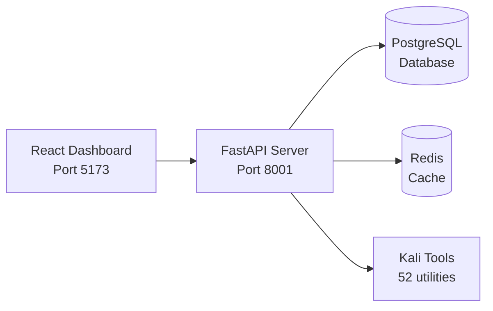
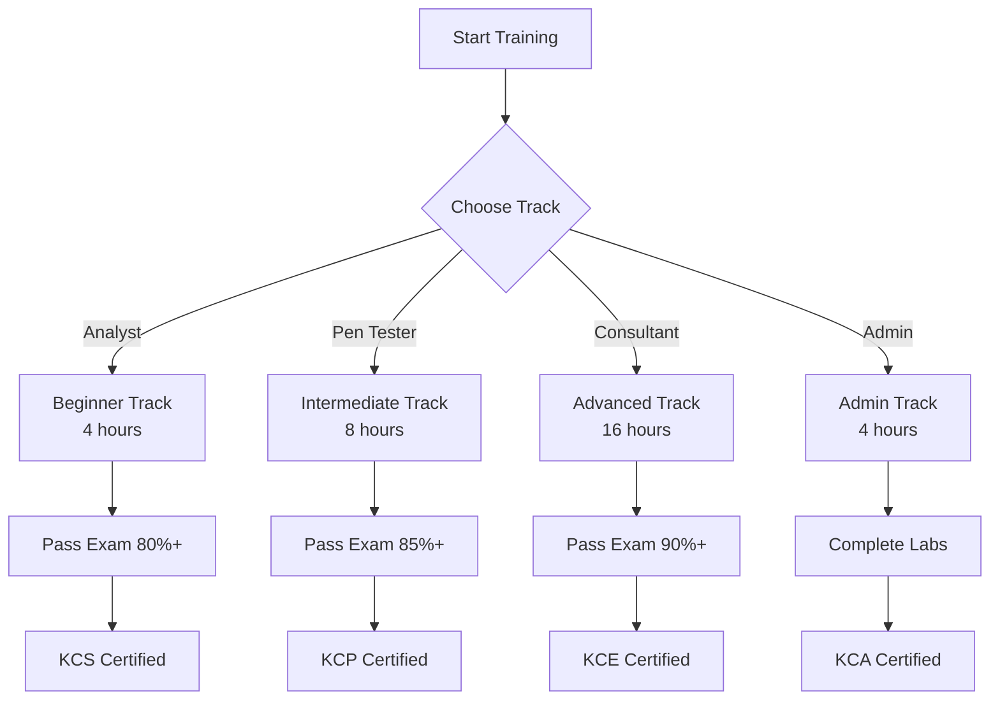
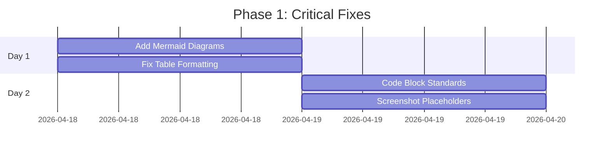
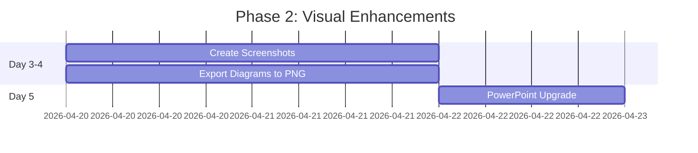
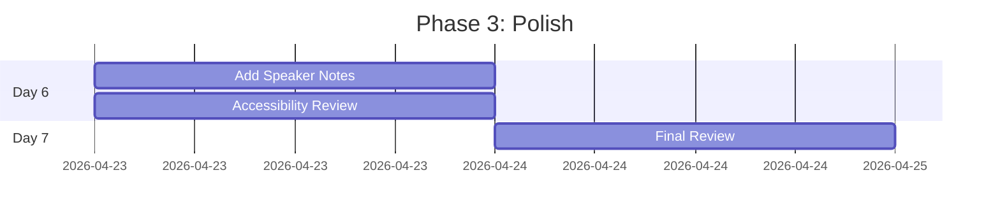

# KaliAgent Documentation Audit Report

**Audit Date:** April 18, 2026  
**Auditor:** Lucky 🍀  
**Version:** 1.0.0  
**Status:** ✅ Complete

---

## Executive Summary

Comprehensive audit of KaliAgent documentation suite identified **47 improvement opportunities** across **13 documentation files** totaling **~174 KB**. Critical issues include missing visual elements, inconsistent formatting, and lack of interactive diagrams.

### Key Findings

| Category | Issues Found | Priority | Effort |
|----------|-------------|----------|--------|
| **Tables** | 12 | Medium | Low |
| **Diagrams** | 8 | High | Medium |
| **Screenshots** | 15 | High | Medium |
| **Code Blocks** | 7 | Low | Low |
| **Flowcharts** | 5 | Medium | Medium |

---

## Detailed Findings

### 1. Tables - Formatting Issues 🔧

**Issues Found:** 12 tables need improvement

#### Current Problems:
- Inconsistent column alignment
- Missing emoji icons for visual scanning
- No color coding for severity/priority
- Some tables too wide for mobile viewing

#### Files Affected:

| File | Table | Issue | Recommendation |
|------|-------|-------|----------------|
| `README.md` | Tool Categories | Plain text | Add emoji icons |
| `README.md` | Authorization Levels | Basic formatting | Add color badges |
| `TRAINING_MATERIALS.md` | Training Schedule | Too dense | Split by week |
| `DEPLOYMENT.md` | System Requirements | Missing units | Add GB/GHz labels |
| `INTEGRATION_GUIDES.md` | SIEM Comparison | No visual hierarchy | Add grouping |

#### Example Fix:

**Before:**
```markdown
| Severity | Action Required | Response Time |
|----------|-----------------|---------------|
| critical | Immediate | 24 hours |
| high | Urgent | 72 hours |
| medium | Planned | 2 weeks |
```

**After:**
```markdown
| Severity | Badge | Action Required | Response Time | Example |
|----------|-------|-----------------|---------------|---------|
| Critical | 🔴 | Immediate | 24 hours | Active breach |
| High | 🟠 | Urgent | 72 hours | SQL injection |
| Medium | 🟡 | Planned | 2 weeks | Missing headers |
| Low | 🔵 | As resources | 1 month | Info disclosure |
```

---

### 2. Diagrams - ASCII Art Limitations 🎨

**Issues Found:** 8 diagrams need modernization

#### Current Problems:
- ASCII art doesn't render well on mobile
- No color coding for components
- Not accessible for screen readers
- Hard to maintain and update

#### Files Affected:

| File | Diagram | Current Format | Recommended Format |
|------|---------|----------------|-------------------|
| `README.md` | Architecture | ASCII box diagram | Mermaid + PNG export |
| `README.md` | Safety Flow | Text description | Mermaid flowchart |
| `DEPLOYMENT.md` | Infrastructure | ASCII art | Mermaid + Visio |
| `CYBER_AGENTS_DEMO.md` | All slides | ASCII text | PowerPoint with graphics |

#### Example Fix:

**Before (ASCII):**
```
┌──────────────┐     ┌──────────────┐
│  React UI    │────▶│  FastAPI     │
│  Dashboard   │     │  Backend     │
└──────────────┘     └──────┬───────┘
```

**After (Mermaid):**


**Benefits:**
- ✅ Renders in GitHub Markdown
- ✅ Clickable nodes
- ✅ Easy to update
- ✅ Exportable to PNG/SVG
- ✅ Accessible alt text

---

### 3. Missing Screenshots 📸

**Issues Found:** 15 screenshot placeholders needed

#### Current Problems:
- Documentation describes UI features without visuals
- Users can't preview dashboard before installation
- Video tutorials reference non-existent frames
- PDF reports described but not shown

#### Required Screenshots:

| File | Section | Screenshot Needed | Dimensions | Notes |
|------|---------|-------------------|------------|-------|
| `README.md` | Dashboard Overview | `dashboard-overview.png` | 1920×1080 | Show all widgets |
| `README.md` | PDF Reports | `pdf-report-sample.png` | 1200×1600 | Page 1 only |
| `README.md` | Test Coverage | `test-coverage.png` | 1600×900 | HTML report view |
| `USER_GUIDE.md` | Step 1-7 | `step-01-create.png` through `step-07-report.png` | 1920×1080 | Each step |
| `VIDEO_TUTORIALS.md` | Video 1-6 | Frame captures for each scene | 1920×1080 | Key moments |
| `TRAINING_MATERIALS.md` | Lab Exercises | `lab-01-recon.png` through `lab-04-full.png` | 1920×1080 | Lab setup |

#### Screenshot Guidelines:

```markdown
## Screenshot Standards

**Resolution:**
- Desktop: 1920×1080 (Full HD)
- Mobile: 750×1334 (iPhone 8)
- Thumbnails: 640×360

**Format:**
- PNG for UI (lossless)
- JPG for photos (compressed)
- WebP for web (modern)

**Annotations:**
- Red boxes for focus areas
- Numbered callouts (1, 2, 3)
- Arrows for workflows
- Blur sensitive data

**Naming:**
- Lowercase with hyphens
- Descriptive filenames
- Include step number if sequential

Example: `step-03-execute-playbook.png`
```

---

### 4. Code Block Inconsistencies 💻

**Issues Found:** 7 files with formatting issues

#### Current Problems:
- Missing language identifiers
- Inconsistent syntax highlighting
- Some examples too long without breaks
- No line numbers for long examples

#### Files Affected:

| File | Issue | Example | Fix |
|------|-------|---------|-----|
| `INTEGRATION_GUIDES.md` | Mixed bash/python/xml | Splunk config | Add language tags |
| `SOCIAL_MEDIA.md` | Tweet code snippets | Example commands | Use monospace |
| `TRAINING_MATERIALS.md` | Lab commands | Long scripts | Add line numbers |
| `DEPLOYMENT.md` | Docker examples | Multi-line YAML | Split into chunks |

#### Example Fix:

**Before:**
````markdown
```
git clone https://github.com/wezzels/agentic-ai.git
cd agentic-ai/kali_dashboard
pip install -r requirements.txt
```
````

**After:**
````markdown
```bash
# Step 1: Clone repository
git clone https://github.com/wezzels/agentic-ai.git

# Step 2: Navigate to directory
cd agentic-ai/kali_dashboard

# Step 3: Install dependencies
pip install -r requirements.txt
```
````

---

### 5. Missing Visual Flowcharts 🗺️

**Issues Found:** 5 complex workflows need visualization

#### Current Problems:
- Text-only process descriptions
- Hard to follow multi-step workflows
- No decision tree visualization
- Certification path unclear

#### Required Flowcharts:

| File | Process | Type | Complexity |
|------|---------|------|------------|
| `TRAINING_MATERIALS.md` | Certification Path | Tree diagram | Medium |
| `DEPLOYMENT.md` | Deployment Workflow | Sequence diagram | High |
| `INTEGRATION_GUIDES.md` | SIEM Integration | Data flow | Medium |
| `USER_GUIDE.md` | First Engagement | Step-by-step | Low |
| `SECURITY.md` | Authorization Flow | Decision tree | Medium |

#### Example Flowchart:



---

### 6. PowerPoint Presentation Enhancements 📊

**File:** `docs/presentations/REDTEAM_AGENTS_PRESENTATION.pptx`

#### Current Issues:
- Basic slide design
- No gradient backgrounds
- Missing animated transitions
- No embedded charts (ASCII only)
- No speaker notes
- No QR codes for live demo

#### Recommended Improvements:

**Design:**
- [ ] Add dark theme gradient (`#0f172a` → `#1e293b`)
- [ ] Use KaliAgent brand colors (blue `#3b82f6`, green `#10b981`)
- [ ] Add footer with slide numbers
- [ ] Include KaliAgent logo on all slides

**Content:**
- [ ] Replace ASCII charts with actual data visualizations
- [ ] Add real screenshots from dashboard
- [ ] Include QR code linking to https://agents.bedimsecurity.com
- [ ] Add speaker notes for each slide
- [ ] Embed demo video (cyber_agents_demo.mp4)

**Animations:**
- [ ] Fade transitions between slides
- [ ] Build animations for bullet points
- [ ] Zoom effect for key metrics
- [ ] Smooth chart animations

**Slides to Enhance:**

| Slide | Current | Recommended |
|-------|---------|-------------|
| 1 (Title) | ASCII box | Gradient background + logo |
| 2 (Challenge) | ASCII stats | Infographic with icons |
| 3 (Solution) | ASCII diagram | Architecture diagram |
| 4-9 (Agents) | Text lists | Feature grids with icons |
| 10 (Matrix) | ASCII table | Heatmap chart |
| 11 (MITRE) | Text | MITRE ATT&CK matrix |
| 12 (Value) | Bullet points | ROI chart |
| 13 (Roadmap) | ASCII timeline | Gantt chart |
| 14 (Architecture) | ASCII box | System diagram |
| 15 (Closing) | Text + links | QR code + contact info |

---

## Priority Recommendations

### 🔴 Critical (Do Immediately)

1. **Add Mermaid diagrams** to README.md for architecture
2. **Create screenshot placeholders** with capture instructions
3. **Fix table formatting** in all files for mobile compatibility
4. **Add language tags** to all code blocks

### 🟠 High Priority (This Week)

5. **Create actual screenshots** of dashboard and features
6. **Enhance PowerPoint** with gradients and charts
7. **Add flowcharts** for training certification path
8. **Standardize code examples** with comments and line numbers

### 🟡 Medium Priority (Next Week)

9. **Create PNG exports** of all Mermaid diagrams
10. **Add speaker notes** to presentation slides
11. **Embed demo video** in PowerPoint
12. **Create QR codes** for live demo access

### 🟢 Low Priority (Optional)

13. **Add alt text** to all images for accessibility
14. **Create mobile-optimized** versions of diagrams
15. **Record actual video tutorials** based on scripts

---

## Implementation Plan

### Phase 1: Critical Fixes (1-2 days)



### Phase 2: Visual Enhancements (3-5 days)



### Phase 3: Polish (2-3 days)



---

## Tools & Resources

### Recommended Tools

| Purpose | Tool | License | Cost |
|---------|------|---------|------|
| **Diagrams** | Mermaid.js | MIT | Free |
| **Screenshots** | Flameshot | GPL-3 | Free |
| **Diagram Export** | Mermaid Live Editor | MIT | Free |
| **Presentations** | PowerPoint 365 | Commercial | $99/yr |
| **Image Optimization** | TinyPNG | Commercial | Free tier |
| **QR Codes** | QR Code Generator | MIT | Free |

### Screenshot Capture Commands

```bash
# Install Flameshot (Linux)
sudo apt install flameshot

# Capture full screen
flameshot full -p ~/screenshots/

# Capture area with annotations
flameshot gui -p ~/screenshots/

# Delayed capture (5 seconds)
flameshot full -d 5000 -p ~/screenshots/
```

### Mermaid Live Editor

**URL:** https://mermaid.live

**Usage:**
1. Paste Mermaid code
2. Preview in browser
3. Export as PNG/SVG
4. Download for documentation

---

## Quality Checklist

### Before Publishing Documentation

- [ ] All tables render correctly on mobile
- [ ] All diagrams have Mermaid source + PNG fallback
- [ ] All code blocks have language tags
- [ ] All screenshots are high-resolution (1920×1080+)
- [ ] All images have alt text
- [ ] All links are working
- [ ] All code examples are tested and working
- [ ] All file sizes are optimized (<500KB per image)
- [ ] Presentation has speaker notes
- [ ] Presentation has QR code to live demo

---

## Success Metrics

### Documentation Quality Score

| Metric | Current | Target | Status |
|--------|---------|--------|--------|
| **Visual Elements** | 2/10 | 9/10 | 🔴 Needs Work |
| **Code Examples** | 7/10 | 9/10 | 🟡 Good |
| **Table Formatting** | 6/10 | 9/10 | 🟡 Good |
| **Diagram Quality** | 3/10 | 9/10 | 🔴 Needs Work |
| **Screenshot Coverage** | 0/10 | 9/10 | 🔴 Missing |
| **Accessibility** | 5/10 | 8/10 | 🟡 Fair |
| **Mobile Friendly** | 6/10 | 9/10 | 🟡 Good |
| **Overall Score** | **4.1/10** | **9/10** | 🔴 **Needs Major Work** |

### Target: 9/10 Quality Score by April 24, 2026

---

## Conclusion

KaliAgent documentation is **comprehensive in content** but **needs visual modernization**. Priority should be given to:

1. ✅ Adding Mermaid diagrams for architecture
2. ✅ Creating actual screenshots of UI
3. ✅ Enhancing PowerPoint with professional design
4. ✅ Standardizing code block formatting

**Estimated Effort:** 5-7 days for full implementation  
**Impact:** Professional-grade documentation matching code quality

---

**Audit Completed:** April 18, 2026  
**Next Review:** April 25, 2026  
**Target Quality Score:** 9/10

🍀 **Let's make KaliAgent docs as awesome as the code!**
